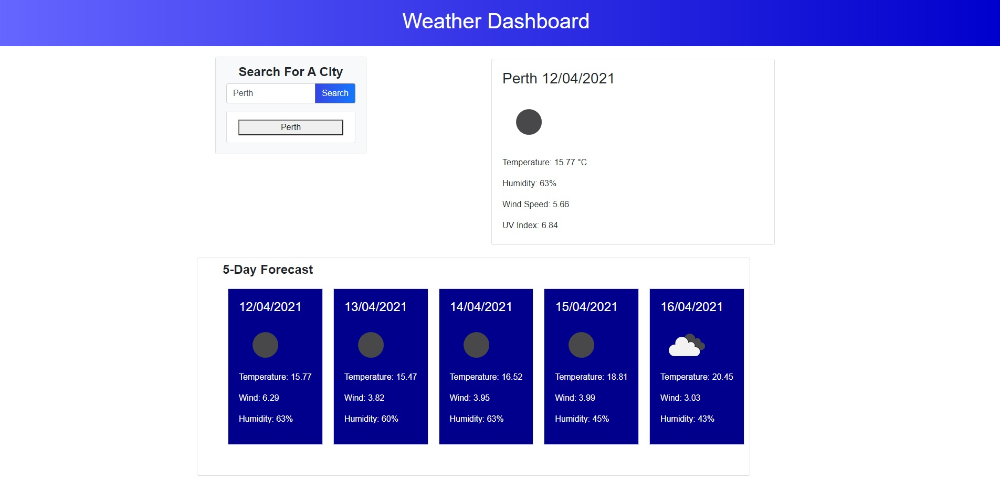
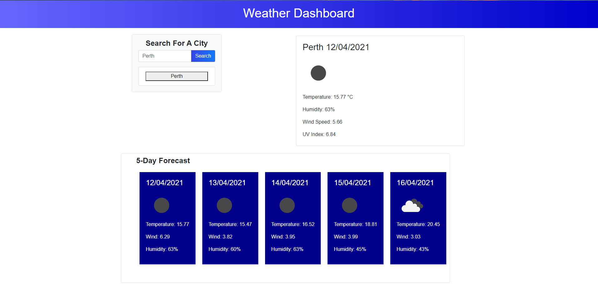

# 06 Server-Side APIs: Weather Dashboard

## User Story

Anyone who uses this application will be able to see the weather outlook for multiple cities, pending which cities they input, so that they are able to plan their trip accordingly. This is based on the below acceptance criteria. [OpenWeather One Call API](https://openweathermap.org/api/one-call-api) is used to retrieve weather data for cities. 

## Requirements

* User is given a weather dashboard with form inputs when they search for a city
* They are presented with current and future conditions for that city and that city is added to the search history
* They are presented with the city name, the date, an icon representation of weather conditions, the temperature, the humidity, the wind speed, and the UV index ( with a color that indicates whether the conditions are favorable, moderate, or severe)
* Whey they view future weather conditions for that city they are presented with a 5-day forecast that displays the date, an icon representation of weather conditions, the temperature, the wind speed, and the humidity
* When they click on a city in the search history, they are again presented with current and future conditions for that city

## HTML
Content is dynamically updated in the HTML by JQuery. Bootstrap has been used to allow for a responsive design, although this can be finessed further.

## CSS
Minimal CSS has been used to create the gradient look in the header, apply styling to the cards and other elements in the HTML.

## JS
There is one JavaScript page that contains arrays, jQuery, event listeners, local storage and more.

Final URL: https://shelbyrp.github.io/Weather-Dashboard/

## Resources
https://getbootstrap.com/docs/5.0/getting-started/introduction/

https://www.w3schools.com/

https://api.jquery.com/

# License

@ Shelby R Pignat

Licensed under the [MIT](LICENSE) license.